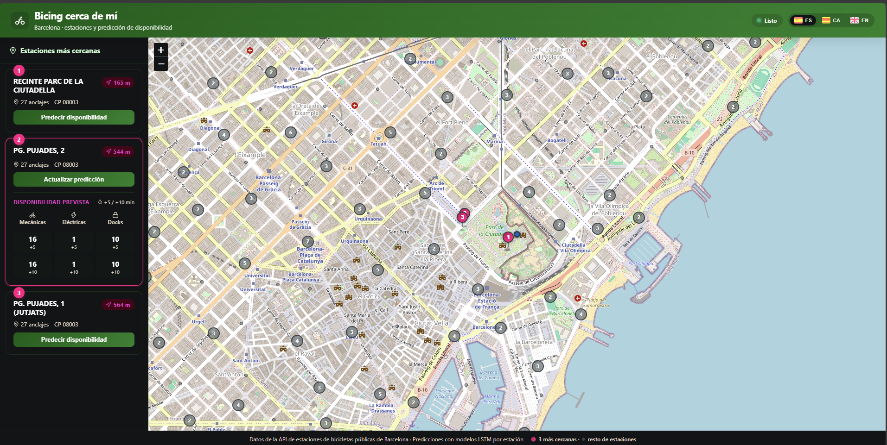

# Frontend Design of Bicing Near Me

## 1. Objective

The project frontend offers an elegant map-based interface to:

- Locate a user's position within Barcelona.
- Show the three nearest Bicing stations in a side panel.
- Check the availability forecast of mechanical bikes, electric bikes, and free docks at 5 and 10 minutes ahead.

---

## 2. Technologies

- **React 19 + Vite**: generated with `pnpm create vite@latest frontend -- --template react`.
- **react-leaflet + Leaflet**: interactive map with markers, popups, tooltips, and cluster grouping.
- **lucide-react**: iconography for the header, cards, popups, and prediction table.
- **Inline SVG**: flags of Spain, Catalonia, and the United Kingdom in the language selector.
- **Custom CSS**: global styles in `frontend/src/App.css` with design variables and responsive support.
- **Own i18n**: `translations` object with texts in Spanish, Catalan, and English.

---

## 3. Main view

The interface is divided into four areas:

1. **Header**: brand with bicycle icon, title "Bicing cerca de mí", subtitle, status badge (Ready / Calculating distances… / Initializing…) and **language selector** with flags (Spain, Catalonia, United Kingdom).
2. **Side panel (sidebar)**: lists the 3 nearest stations as interactive cards, with ranking, distance, capacity, postal code, and a compact prediction summary.
3. **Map**: occupies the main body, shows the user's location, highlighted stations with numbered pins, and the rest as faded dots grouped into clusters when zooming out.
4. **Footer**: legend with the data source, the predictive architecture, and a visual legend distinguishing the pins of the 3 nearest stations from the gray dots of the remaining stations.

The following image illustrates the current visual result of the frontend:



## 4. Implemented steps

### 4.1 Station loading

When the application starts, it queries the `GET /api/informacion` endpoint of the Flask backend. The response, a dictionary of stations, is converted to an array and filtered, discarding coordinates outside the Barcelona metropolitan area.

### 4.2 User location

In the development phase, a random point is generated within the municipality of Barcelona and snapped to the nearest street or pedestrian sidewalk:

- The administrative polygon of Barcelona is downloaded and cached from Nominatim.
- `OSRM /routed-foot/nearest` is used to obtain the nearest public road point on foot.
- If it fails after several attempts, a fallback point in a safe urban area is used.

### 4.3 Selection of the three nearest stations

1. Stations are ordered by straight-line distance (Haversine) and the first 8 are taken as candidates.
2. The real walking distance is queried via the `OSRM /routed-foot/table` endpoint in a single request (10 s timeout and retries for transient errors).
3. They are ordered by walking distance and the 3 nearest are kept.
4. If OSRM does not return a distance for any candidate, the straight-line distance is kept as an approximation and indicated visually.

### 4.4 Station side panel

The three nearest stations are rendered as cards in the sidebar:

- **Visual ranking**: pink circular badge with 1, 2, or 3.
- **Distance**: badge with navigation icon, walking distance if OSRM responds or approximate straight-line distance if it fails.
- **Metadata**: total capacity and postal code.
- **Action**: "Predict availability" button that calls `POST /api/predict`.
- **Compact summary**: when the prediction is already loaded, the card shows a mini table with mechanical, electric, and docks at +5 and +10 min.

The cards are clickable: they select the station and, when the button is pressed, they obtain or update the prediction.

On mobile devices, the side panel becomes a **slidable bottom panel**. A pink floating button in the bottom right corner of the map allows opening or closing it, so that the map occupies all available space and the user can consult it without distractions. When a card is tapped, the panel closes automatically and the selected station is centered on the map.

### 4.5 Map rendering

- The base layer comes from OpenStreetMap.
- The three nearest stations are highlighted with a pink numbered pin marker (1, 2, 3).
- The remaining stations are shown as faded dots and grouped into clusters when zooming out.
- The user's location is represented by a blue dot with a pulse halo.
- Clicking a highlighted marker opens a popup with station information and the prediction.

### 4.6 Popups and prediction

The popup of a highlighted station has a card format:

- **Green header**: ranking + station name, capacity, and postal code.
- **Distance**: badge with navigation icon, indicating whether it is on foot or approximate.
- **Prediction table**: shows mechanical bikes, electric bikes, and free docks at +5 and +10 minutes.

Each row has a `lucide-react` icon (bicycle, lightning, lock) to facilitate reading.

### 4.7 Internationalization (i18n)

The frontend supports three languages managed from a translation object in `frontend/src/App.jsx`:

- **Spanish (es)** — flag of Spain.
- **Catalan (ca)** — senyera (flag of Catalonia).
- **English (en)** — Union Jack (flag of the United Kingdom).

The language selector is located in the header, to the right of the status badge. Each option shows the corresponding flag and the language code (`ES`, `CA`, `EN`). The selection persists in `localStorage` and applies to all interface texts: title, subtitle, loader, sidebar, cards, tooltips, popups, prediction table, errors, and footer.

### 4.8 Styles and icons

- **Palette**: forest green (`#1b5e20`) and Bicing pink (`#e6007e`) with white and soft gray, using CSS variables to maintain consistency.
- **Shadows and rounded borders**: cards, map, popups, and tooltips with `border-radius` and soft shadows for a modern look.
- **Header**: green gradient with bicycle icon, dynamic status badge, and language selector with flags.
- **Initial loader**: pulsating dots animation instead of an hourglass.
- **Tooltips**: on hover over highlighted markers, with address, postal code, and distance.
- **Icons from `lucide-react`**: header, sidebar cards, popups, and prediction table.
- **Visual differentiation**: the 3 nearest stations use pink numbered pins; the rest appear as small neutral gray dots, with a legend in the footer to avoid confusion.
- **Responsive**: on narrow screens the sidebar becomes a slidable bottom panel with a floating pink button to show or hide it; the header, popups, and prediction table scale to occupy the full available width without breaking the layout.

---

## 5. Integration with the backend

The frontend expects the Flask backend at `http://127.0.0.1:5002`:

- `GET /api/informacion`: list of stations with coordinates, address, postal code, and capacity. Only stations that have a model registered in MLflow are returned.
- `POST /api/predict`: prediction for a specific `station_id`, loading the model from MLflow.

MLflow must be running previously at `http://127.0.0.1:5000` with the command:

```bash
mlflow server --backend-store-uri sqlite:///C:/Users/juand/mlflow.db --default-artifact-root C:/Users/juand/mlartifacts --serve-artifacts --host 127.0.0.1 --port 5000
```

## 6. Considerations

- The Leaflet attribution control is hidden on the map.
- The prediction loads an already trained model from MLflow. The first request for a station downloads the artifacts on the server (~20-30 s); subsequent ones use the in-memory cache and are almost immediate. The prior training is done once with `backend/pipelines/ml/train_all_stations.py`.
- Walking distances are calculated with OSRM; if the service fails, an approximate straight-line distance is shown.
- The sidebar shows a compact prediction summary; the map popup provides the full detail.
- The footer includes a visual legend: pink numbered pin = 3 nearest stations; gray dot = remaining stations.
- The language selector and translations are implemented internally in the frontend without an external library, facilitating maintenance and expansion.
- On mobile, the station panel is presented as a slidable *bottom sheet* controlled by a floating button; no separate frontend project is needed because the responsive design is managed with media queries and local React states.
- The original results returned by the LSTM model can also be viewed from the browser console.
