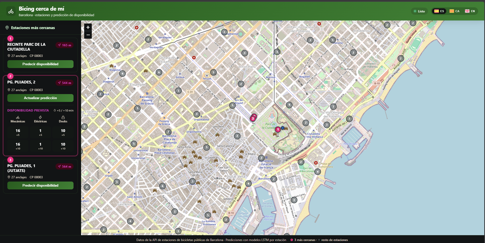

# Diseño del Frontend de Bicing Cerca de Mí

## 1. Objetivo

El frontend del proyecto ofrece una interfaz cartográfica elegante para:

- Localizar una posición de usuario dentro de Barcelona.
- Mostrar las tres estaciones de Bicing más cercanas en un panel lateral.
- Consultar la predicción de disponibilidad de bicicletas mecánicas, eléctricas y anclajes libres a 5 y 10 minutos vista.

## 2. Tecnologías

- **React 19 + Vite**: generado con `pnpm create vite@latest frontend -- --template react`.
- **react-leaflet + Leaflet**: mapa interactivo con marcadores, popups, tooltips y agrupación en clústeres.
- **lucide-react**: iconografía del header, tarjetas, popups y tabla de predicciones.
- **SVG inline**: banderas de España, Cataluña y Reino Unido en el selector de idioma.
- **CSS personalizado**: estilos globales en `frontend/src/App.css` con variables de diseño y soporte responsive.
- **i18n propia**: objeto de traducciones `translations` con textos en español, catalán e inglés.

## 3. Vista principal

La interfaz se divide en cuatro zonas:

1. **Cabecera**: marca con icono de bicicleta, título "Bicing cerca de mí", subtítulo, badge de estado (Listo / Calculando distancias… / Inicializando…) y **selector de idioma** con banderas (España, Cataluña, Reino Unido).
2. **Panel lateral (sidebar)**: lista las 3 estaciones más cercanas como tarjetas interactivas, con ranking, distancia, capacidad, código postal y un resumen compacto de la predicción.
3. **Mapa**: ocupa el cuerpo principal, muestra la ubicación del usuario, las estaciones destacadas con pins numerados y el resto como puntos atenuados agrupados en clústeres.
4. **Pie**: leyenda con el origen de los datos, la arquitectura predictiva y una leyenda visual que distingue los pins de las 3 estaciones más cercanas de los puntos grises del resto de estaciones.

La siguiente imagen ilustra el resultado visual actual del frontend:



## 4. Pasos implementados

### 4.1 Carga de estaciones

Al iniciar la aplicación se consulta el endpoint `GET /api/informacion` del backend Flask. La respuesta, un diccionario de estaciones, se convierte a un array y se filtra descartando coordenadas fuera del área metropolitana de Barcelona.

### 4.2 Localización del usuario

En fase de desarrollo, se genera un punto aleatorio dentro del término municipal de Barcelona y se ajusta (snap) a la calle o acera peatonal más cercana:

- Se descarga y cachea el polígono administrativo de Barcelona desde Nominatim.
- Se usa `OSRM /routed-foot/nearest` para obtener el punto de la vía pública más cercano a pie.
- Si falla tras varios intentos, se recurre a un punto de respaldo en una zona urbana segura.

### 4.3 Selección de las tres estaciones más cercanas

1. Se ordenan las estaciones por distancia en línea recta (Haversine) y se toman las 8 primeras como candidatas.
2. Se consulta la distancia real caminando mediante el endpoint `OSRM /routed-foot/table` en una sola petición (timeout de 10 s y reintentos ante errores transitorios).
3. Se ordenan por distancia peatonal y se conservan las 3 más cercanas.
4. Si OSRM no devuelve distancia para alguna candidata, se conserva la distancia en línea recta como aproximación y se indica visualmente.

### 4.4 Panel lateral de estaciones

Las tres estaciones más cercanas se renderizan como tarjetas en el sidebar:

- **Ranking visual**: badge circular rosa con 1, 2 o 3.
- **Distancia**: badge con icono de navegación, distancia a pie si OSRM responde o distancia aproximada en línea recta si falla.
- **Metadatos**: capacidad total y código postal.
- **Acción**: botón "Predecir disponibilidad" que llama a `POST /api/predict`.
- **Resumen compacto**: cuando la predicción ya está cargada, la tarjeta muestra una mini tabla con mecánicas, eléctricas y docks a +5 y +10 min.

Las tarjetas son clicables: seleccionan la estación y, al pulsar el botón, obtienen o actualizan la predicción.

### 4.5 Renderizado del mapa

- La capa base se obtiene de OpenStreetMap.
- Las tres estaciones más cercanas se destacan con un marcador rosa tipo pin **numerado** (1, 2, 3).
- El resto de estaciones se muestran como puntos atenuados y se agrupan en clústeres al reducir el zoom.
- La ubicación del usuario se representa con un punto azul con halo de pulso.
- Al hacer clic en un marcador destacado se abre un popup con la información de la estación y la predicción.

### 4.6 Popups y predicción

El popup de una estación destacada tiene formato de tarjeta:

- **Cabecera verde**: ranking + nombre de la estación, capacidad y código postal.
- **Distancia**: badge con icono de navegación, indicando si es a pie o aproximada.
- **Tabla de predicción**: muestra bicicletas mecánicas, eléctricas y anclajes libres a +5 y +10 minutos.

Cada fila lleva un icono de `lucide-react` (bicicleta, rayo, candado) para facilitar la lectura.

### 4.7 Internacionalización (i18n)

El frontend soporta tres idiomas gestionados desde un objeto de traducciones en `frontend/src/App.jsx`:

- **Español (es)** — bandera de España.
- **Catalán (ca)** — senyera (bandera de Cataluña).
- **Inglés (en)** — Union Jack (bandera del Reino Unido).

El selector de idioma se ubica en la cabecera, a la derecha del badge de estado. Cada opción muestra la bandera correspondiente y el código de idioma (`ES`, `CA`, `EN`). La selección se persiste en `localStorage` y se aplica a todos los textos de la interfaz: título, subtítulo, loader, sidebar, tarjetas, tooltips, popups, tabla de predicciones, errores y pie de página.

### 4.8 Estilos e iconos

- **Paleta**: verde bosque (`#1b5e20`) y rosa Bicing (`#e6007e`) con blanco y gris suave, usando CSS variables para mantener coherencia.
- **Sombras y bordes redondeados**: tarjetas, mapa, popups y tooltips con `border-radius` y sombras suaves para un aspecto moderno.
- **Header**: gradiente verde con icono de bicicleta, badge de estado dinámico y selector de idioma con banderas.
- **Loader inicial**: animación de puntos pulsantes en lugar de un reloj de arena.
- **Tooltips**: al pasar el ratón sobre los marcadores destacados, con dirección, código postal y distancia.
- **Iconos de `lucide-react`**: header, tarjetas del sidebar, popups y tabla de predicciones.
- **Diferenciación visual**: las 3 estaciones más cercanas usan pins rosas numerados; el resto aparece como pequeños puntos grises neutros, con leyenda en el pie para evitar confusión.
- **Responsive**: en pantallas estrechas el sidebar pasa a una banda horizontal sobre el mapa.

## 5. Integración con el backend

El frontend espera el backend Flask en `http://127.0.0.1:5002`:

- `GET /api/informacion`: listado de estaciones con coordenadas, dirección, código postal y capacidad. Solo se devuelven las estaciones que tienen un modelo registrado en MLflow.
- `POST /api/predict`: predicción para un `station_id` concreto, cargando el modelo desde MLflow.

MLflow debe estar ejecutándose previamente en `http://127.0.0.1:5000` con el comando:

```bash
mlflow server --backend-store-uri sqlite:///C:/Users/juand/mlflow.db --default-artifact-root C:/Users/juand/mlartifacts --serve-artifacts --host 127.0.0.1 --port 5000
```

## 6. Consideraciones

- El control de atribución de Leaflet está oculto en el mapa.
- La predicción carga un modelo ya entrenado desde MLflow. La primera petición de una estación descarga los artifacts en el servidor (~20-30 s); las siguientes usan el cache en memoria y son casi inmediatas. El entrenamiento previo se realiza una sola vez con `backend/scripts/train_all_stations.py`.
- Las distancias a pie se calculan con OSRM; si el servicio falla se muestra una distancia aproximada en línea recta.
- El sidebar muestra un resumen compacto de la predicción; el popup del mapa ofrece el detalle completo.
- El footer incluye una leyenda visual: pin rosa numerado = 3 estaciones más cercanas; punto gris = resto de estaciones.
- El selector de idioma y las traducciones están implementados de forma interna en el frontend sin librería externa, facilitando su mantenimiento y ampliación.
- Desde la consola del navegador también se puede ver los resultados originales que arroja el modelo LSTM.
